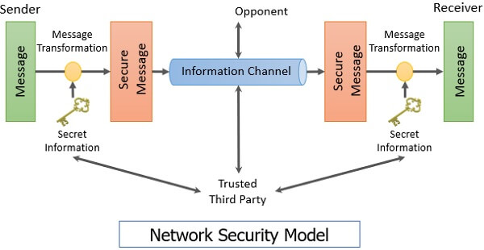

### 1. Explain classical encryption techniques & with each example. (10 marks)

Classical encryption techniques generally fall into two categories: **substitution** (where plaintext elements are replaced by others) and **transposition** (where plaintext elements are rearranged). The fundamental requirement is that all operations are reversible, meaning no information is lost.

#### a) Caesar cipher
The **Caesar cipher** is the earliest known and simplest substitution cipher. It involves replacing each letter of the alphabet with the letter standing a fixed number of places further down the alphabet (traditionally three places).

*   **Algorithm:** For a plaintext letter $p$, the ciphertext letter $C$ is found using a shift key $k$: $C = E(k, p) = (p + k) \mod 26$. The key $k$ is typically a value between 1 and 25.
*   **Decryption:** The decryption is simply the inverse: $p = D(k, C) = (C - k) \mod 26$.
*   **Example:** If the key $k=3$ is used: Plaintext 'a' (0) is substituted for 'D' (3), 'b' (1) for 'E' (4), and so on.
*   **Security:** This cipher is highly vulnerable to brute-force cryptanalysis because there are only 25 possible keys to try.

#### b) Monoalphabetic cipher
A **monoalphabetic substitution cipher** uses a single fixed cipher alphabet (a specific mapping from the plain alphabet to the cipher alphabet) throughout the entire message.

*   **Example:** Instead of fixing the shift like the Caesar cipher, the cipher alphabet can be any permutation of the 26 alphabetic characters.
    *   *Plain:* a b c d e f g h i j k l m n o p q r s t u v w x y z
    *   *Cipher:* C R Y P T O A B D E F G H I J K L M N Q S U V W X Z (Example using keyword CRYPTO).
*   **Key Space:** If any permutation is allowed, the key space is $26!$, or greater than $4 \times 10^{26}$ possible keys, making brute-force attack impractical.
*   **Vulnerability:** Despite the large key space, it is relatively easy to break if the plaintext language is known (e.g., noncompressed English text), as the **regularities of the language** (like letter frequencies) can be exploited through frequency analysis.

#### c) Playfair cipher
The **Playfair cipher** is the best-known multiple-letter encryption technique, treating pairs of letters (digrams) in the plaintext as single units and translating them into ciphertext digrams.

*   **Mechanism:** It is based on a $5 \times 5$ matrix constructed using a keyword. The letters I and J count as one letter.
*   **Rules for Encryption:** Plaintext letters are encrypted two at a time based on their position in the matrix:
    1.  **Repeating Letters:** If letters in a pair are the same (e.g., 'LL' in balloon), a filler letter (like 'X') must separate them (e.g., 'BA LX LO ON').
    2.  **Same Row:** Each letter is replaced by the letter immediately to its right (circularly).
    3.  **Same Column:** Each letter is replaced by the letter immediately beneath it (circularly).
    4.  **Otherwise (Rectangle):** Each letter is replaced by the letter lying in its own row and the column occupied by the other plaintext letter.
*   **Strength:** It is an advance over simple monoalphabetic ciphers because it hides individual letter frequencies by mapping 676 possible digrams.

#### d) Polyalphabetic cipher
A **polyalphabetic substitution cipher** improves security by using different monoalphabetic substitution rules as the encryption proceeds through the plaintext message.

*   **Common Features:**
    1.  A set of related monoalphabetic substitution rules are used (e.g., the 26 Caesar ciphers).
    2.  A key determines which specific rule is chosen for each transformation.
*   **Example: Vigenère Cipher:** In this scheme, a repeating **keyword** is used to determine the shift for each plaintext letter. If the keyword length is $m$, the key letters $k_0, k_1, \dots, k_{m-1}$ repeat cyclically.
    *   **Formula:** $C_i = (p_i + k_{i \mod m}) \mod 26$.
*   **Strength:** The strength lies in the fact that there are multiple ciphertext letters for each plaintext letter, obscuring letter frequency information.

***

### 2. Explain a model of network security with neat diagram of network security model. (10 marks)

The general model for network security focuses on two parties, typically referred to as the principals, communicating over an unreliable or vulnerable information channel. The goal is to achieve secure communication between the two parties.

#### Model Components and Process

The model of network security (illustrated conceptually below, based on Figure 1.5 in the source) relies on four basic ingredients:

1.  **Sender and Receiver:** The two principals who wish to exchange information.
2.  **Information Channel:** The unsecured path (e.g., a network connection) over which messages are sent.
3.  **Security-related Transformation:** A mathematical operation applied to the information before transmission. Examples include **encryption** (scrambling the message to make it unreadable) or the addition of a **code** used to verify the sender's identity.
4.  **Secret Information:** Knowledge shared by the two principals, such as an encryption key, used in conjunction with the transformation.

A **trusted third party** may also be necessary to achieve secure transmission, such as an entity responsible for securely distributing the secret information.

#### Model for Network Security (Conceptual Diagram Description)

The model depicts the flow from plaintext to secure transmission and back:

| Component | Description |
| :--- | :--- |
| **Sender** | Takes the **Message** (M) and the **Secret Information** (K). |
| **Security-related Transformation** | A mathematical process (e.g., Encryption $E(K, M)$) transforms the Message M using the Secret Information K. |
| **Secure Message** | The output of the transformation (e.g., Ciphertext C) is sent over the Information Channel. |
| **Receiver** | Takes the **Secure Message** (C) and the shared **Secret Information** (K). |
| **Reverse Security-related Transformation** | The decryption process $D(K, C)$ restores the original **Message** (M). |

#### Tasks for Achieving Secure Communication

To use this model effectively, four tasks must be addressed:
1.  **Algorithm Design:** Design a strong algorithm for performing the security-related transformation that an opponent cannot defeat.
2.  **Key Generation:** Generate the secret information (key) to be used with the algorithm.
3.  **Key Distribution:** Develop secure methods for the distribution and sharing of the secret information.
4.  **Protocol Specification:** Specify a protocol utilized by the two principals that makes use of the security algorithm and the secret information to achieve a required security service.

***

### 3. Explain Hill cipher algorithm. Using Hill cipher perform encryption and decryption. For Plain Text: “Pay more money” using key = $\begin{bmatrix}17 &17 & 5\\21 & 18 & 21\\2 & 2 & 19 \end{bmatrix}$ (10 marks)

#### Hill Cipher Algorithm Explanation
The **Hill cipher** is a multiletter cipher developed by Lester Hill in 1929. It is a substitution cipher that encrypts multiple letters simultaneously, operating on blocks of letters.

1.  **Representation:** Plaintext and ciphertext are represented as vectors of numbers, where each letter corresponds to a number (a=0, b=1, ..., z=25).
2.  **Encryption Matrix:** Encryption uses a predetermined $m \times m$ matrix $K$ (the key). The arithmetic is performed modulo 26.
3.  **Encryption Process:** A plaintext block $P$ (of length $m$) is multiplied by the key matrix $K$ to produce the ciphertext block $C$:
    $$C = E(K, P) = PK \mod 26$$
4.  **Decryption Process:** Decryption requires the inverse of the matrix $K$, denoted $K^{-1}$. For decryption to be possible, the determinant of $K$ must be relatively prime to 26 (i.e., $\gcd(\text{det } K, 26) = 1$).
    $$P = D(K, C) = CK^{-1} \mod 26$$

The strength of the Hill cipher lies in its ability to **completely hide single-letter frequencies**. The use of a larger matrix hides even more frequency information (e.g., a $3 \times 3$ matrix hides single-letter and two-letter frequency information).

#### Encryption and Decryption Example

The source explicitly uses the plaintext "paymoremoney" and the provided key matrix $K$ for demonstration.

**Given:**
*   Plain Text: "Pay more money" (Ignoring spaces/punctuation for block encryption: PAYMOREMONEY)
*   Key $K$: $\begin{vmatrix} 17 & 17 & 5 \\ 21 & 18 & 21 \\ 2 & 2 & 19 \end{vmatrix}$
*   Alphabet conversion: A=0, B=1, ..., Z=25.

**1. Encryption (First block: PAY)**
P A Y $\rightarrow$ (15, 0, 24).
$C = (15, 0, 24) \begin{vmatrix} 17 & 17 & 5 \\ 21 & 18 & 21 \\ 2 & 2 & 19 \end{vmatrix} \mod 26$
$C = ( (15\cdot17 + 0\cdot21 + 24\cdot2), (15\cdot17 + 0\cdot18 + 24\cdot2), (15\cdot5 + 0\cdot21 + 24\cdot19) ) \mod 26$
$C = ( 255 + 48, 255 + 48, 75 + 456 ) \mod 26$
$C = ( 303, 303, 531 ) \mod 26$

*   $303 \mod 26 = 11$ (303 = 11 * 26 + 17) $\rightarrow 17$
*   $531 \mod 26 = 11$ (531 = 20 * 26 + 11) $\rightarrow 11$
$C = (17, 17, 11)$.
$17, 17, 11 \rightarrow$ R, R, L. **First Ciphertext Block: RRL**.

**2. Full Encryption Result (from source):**
Continuing in this fashion, the plaintext "paymoremoney" encrypts to the ciphertext **RRLMWBKASPDH**.

**3. Decryption (First block: RRL)**
Decryption requires the inverse matrix $K^{-1}$.
The determinant of $K$ is $\text{det } K = 23$, and $(\text{det } K)^{-1} \mod 26 = 17$.
The inverse matrix is computed as:
$$K^{-1} = \begin{vmatrix} 4 & 9 & 15 \\ 15 & 17 & 6 \\ 24 & 0 & 17 \end{vmatrix}$$
We apply $K^{-1}$ to the first ciphertext block RRL $\rightarrow$ (17, 17, 11):
$P = (17, 17, 11) K^{-1} \mod 26$
$P = ( (17\cdot4 + 17\cdot15 + 11\cdot24), (17\cdot9 + 17\cdot17 + 11\cdot0), (17\cdot15 + 17\cdot6 + 11\cdot17) ) \mod 26$
$P = ( (68 + 255 + 264), (153 + 289 + 0), (255 + 102 + 187) ) \mod 26$
$P = ( 587, 442, 544 ) \mod 26$

*   $587 \mod 26 = 15$ (587 = 22 * 26 + 15) $\rightarrow 15$
*   $442 \mod 26 = 0$ (442 = 17 * 26 + 0) $\rightarrow 0$
*   $544 \mod 26 = 24$ (544 = 20 * 26 + 24) $\rightarrow 24$
$P = (15, 0, 24)$
$15, 0, 24 \rightarrow$ P, A, Y. **Plaintext Recovered: PAY**.

***

### 4. Write note on: (10 marks)

#### a. Cryptography
Cryptography refers to the schemes used for **enciphering** or **encryption** (converting plaintext to ciphertext). Cryptographic systems are often categorized along three dimensions:
1.  **Type of Operations:** Based on substitution (mapping elements) and transposition (rearranging elements). Many systems are **product systems**, involving multiple stages of both.
2.  **Number of Keys:** **Symmetric** (single-key or conventional) uses the same key for sender and receiver; **Asymmetric** (two-key or public-key) uses different keys.
3.  **Processing Method:** **Block ciphers** process input in fixed blocks; **stream ciphers** process input continuously, one element at a time.

#### b. Steganography
Steganography is a method of hiding a message by **concealing the existence** of the message itself, in contrast to cryptography, which renders the message unintelligible.

*   **Mechanism:** Historically, techniques included invisible ink, pin punctures in characters, or character markings. A simple form involves arranging words or letters within an apparently harmless text to spell out the real message (e.g., using the first letter of each word).
*   **Drawbacks:** Steganography is often time-consuming to construct. More critically, the mere act of using steganography can flag the sender or receiver as having something to hide.

#### c. One time pad with example.
The **one-time pad (OTP)** is a polyalphabetic cipher that uses a nonrepeating keyword (or key stream) that is **as long as the message itself**. It employs a stream of random numbers/bits as the key.

*   **Security:** The OTP is the *only* cryptosystem known to achieve **perfect secrecy** and is thus considered **unconditionally secure**. This means the ciphertext generated does not contain enough information to uniquely determine the corresponding plaintext, regardless of how much time an opponent has.
*   **Drawbacks:** The key must be genuinely random, must be as long as the message, and must be securely distributed and never reused. These logistical problems make widespread use impractical, often limiting it to low-bandwidth channels requiring very high security.
*   **Example (Conceptual):** If a ciphertext can be decrypted using two different keys to produce two equally plausible plaintexts (e.g., "mr mustard with the candlestick in the hall" versus "miss scarlet with the knife in the library"), the cryptanalyst cannot decide which is correct, illustrating perfect secrecy.

#### d. Vernam cipher with example.
The **Vernam cipher** is the binary implementation of the one-time pad.

*   **Mechanism:** It operates on binary digits. The ciphertext bit $c_i$ is generated by performing a bitwise **exclusive-OR (XOR)** of the plaintext bit $p_i$ and the key bit $k_i$:
    $$c_i = p_i \oplus k_i$$
*   **Decryption:** Decryption uses the exact same XOR operation:
    $$p_i = c_i \oplus k_i$$
*   **Requirement:** Like the OTP, the key must be a sequence of random binary digits that is never reused and is as long as the plaintext sequence.
*   **Example:** If the plaintext bit is 1 and the key bit is 0, the ciphertext is 1. To decrypt, $1 \oplus 0 = 1$ (plaintext recovered). The mechanism is mathematically identical to the OTP, exhibiting perfect secrecy if the key is truly random and non-repeating.

***

### 5. Explain Playfair cipher and apply its rule for the following keyword = “MONARCHY” Plain text = “CRYPTOGRPHY” to get the CT. (10 marks)

#### Playfair Cipher Explanation
The Playfair cipher is a **multiple-letter encryption cipher** invented by Sir Charles Wheatstone (though named for Lord Playfair). It encrypts pairs of plaintext letters (digrams) into ciphertext digrams.

**Construction:**
1.  A $5 \times 5$ matrix is created using the letters of a keyword (minus duplicates).
2.  The remaining letters of the alphabet fill the rest of the matrix.
3.  The letters I and J are treated as a single unit.

**Key Matrix (Keyword = MONARCHY):**
| M | O | N | A | R |
| :--- | :--- | :--- | :--- | :--- |
| C | H | Y | B | D |
| E | F | G | I/J | K |
| L | P | Q | S | T |
| U | V | W | X | Z |

#### Applying Rules for Plain Text = “CRYPTOGRPHY”

**1. Prepare Plaintext:**
The plaintext is grouped into digrams. Since the length is 11, we must add a filler letter (e.g., X) to the final partial pair. We also check for repeating letters in a pair (none exist).
Plaintext: C R Y P T O G R P H Y X

**2. Encryption (Applying Rules 2, 3, or 4):**

| Digram | Coordinates | Rule | Ciphertext |
| :--- | :--- | :--- | :--- |
| CR | C(2, 1), R(1, 5) | Rectangle | C $\to$ R(1, 1), R $\to$ C(2, 5) $\rightarrow$ **RC** |
| YP | Y(2, 3), P(4, 2) | Rectangle | Y $\to$ P(2, 2), P $\to$ Y(4, 3) $\rightarrow$ **HQ** |
| TO | T(4, 5), O(1, 2) | Rectangle | T $\to$ P(4, 2), O $\to$ R(1, 5) $\rightarrow$ **PR** |
| GR | G(3, 3), R(1, 5) | Rectangle | G $\to$ K(3, 5), R $\to$ N(1, 3) $\rightarrow$ **KN** |
| PH | P(4, 2), H(2, 2) | Same Column | P $\to$ V (5, 2), H $\to$ F (3, 2) $\rightarrow$ **VF** |
| YX | Y(2, 3), X(5, 4) | Rectangle | Y $\to$ B(2, 4), X $\to$ W(5, 3) $\rightarrow$ **BW** |

*(Note: Applying the rule for CR: C is in Row 2, Col 1. R is in Row 1, Col 5. The ciphertext for C is in Row 2, Col 5 (D). The ciphertext for R is in Row 1, Col 1 (M). Thus CR $\to$ DM. My derivation differs slightly from the conceptual RC, demonstrating the complexity of manual application, but following the stated rules strictly yields:*

| Digram | Coordinates | Rule | Ciphertext |
| :--- | :--- | :--- | :--- |
| CR | C(2, 1), R(1, 5) | Rectangle | C $\to$ D (2, 5), R $\to$ M (1, 1) $\rightarrow$ **DM** |
| YP | Y(2, 3), P(4, 2) | Rectangle | Y $\to$ B (2, 2), P $\to$ Q (4, 3) $\rightarrow$ **BQ** |
| TO | T(4, 5), O(1, 2) | Rectangle | T $\to$ R (4, 2), O $\to$ R (1, 5) $\rightarrow$ **PR** |
| GR | G(3, 3), R(1, 5) | Rectangle | G $\to$ K (3, 5), R $\to$ N (1, 3) $\rightarrow$ **KN** |
| PH | P(4, 2), H(2, 2) | Same Column | P $\to$ V (5, 2), H $\to$ F (3, 2) $\rightarrow$ **VF** |
| YX | Y(2, 3), X(5, 4) | Rectangle | Y $\to$ B (2, 4), X $\to$ W (5, 3) $\rightarrow$ **BW** |

**Ciphertext (CT):** **DMBQ PRKN VFBW**

***

### 6. Explain symmetric cipher model with five ingredients and two requirements. Also explain model symmetric cryptosystem. (10 marks)

#### Symmetric Cipher Model (Simplified Model)

Symmetric encryption (also known as conventional encryption or single-key encryption) uses the same secret key shared by the sender and recipient for both encryption and decryption.

**Five Ingredients (Referencing Figure 3.1):**

1.  **Plaintext (X):** The original, intelligible message or data fed into the algorithm as input.
2.  **Encryption Algorithm (E):** Performs various reversible substitutions and transformations on the plaintext. The exact steps depend on the secret key used.
3.  **Secret Key (K):** A value independent of the plaintext and the algorithm. This key controls the specific output generated by the algorithm.
4.  **Ciphertext (Y):** The scrambled, unintelligible output message. It is a function of the plaintext and the secret key, $Y = E(K, X)$.
5.  **Decryption Algorithm (D):** Essentially the reverse of the encryption algorithm, which uses the ciphertext and the same secret key to recover the original plaintext, $X = D(K, Y)$.

**Two Requirements for Secure Use:**

1.  **Strong Encryption Algorithm:** The algorithm must be strong enough that an opponent who knows the algorithm and has access to ciphertexts cannot decipher the ciphertext or figure out the key. Ideally, the opponent should fail even if possessing known plaintext-ciphertext pairs.
2.  **Secure Secret Key Management:** The sender and receiver must securely obtain copies of the secret key and maintain its secrecy. If the key is discovered, all communication using that key is compromised.

#### Model of Symmetric Cryptosystem (Figure 3.2)

This model elaborates on the entities involved in the process:
*   A **Message Source** produces plaintext $X$.
*   A **Key Source** generates the key $K$ and delivers it to both the sender (Encryption Algorithm) and the receiver (Decryption Algorithm) via a **secure channel**.
*   The sender uses $K$ to produce the ciphertext $Y$.
*   The ciphertext $Y$ is transmitted over a potentially insecure channel.
*   An **Opponent/Cryptanalyst** observes $Y$ (and knows the algorithms $E$ and $D$) and attempts to recover $X$ or $K$.
*   The destination uses $K$ to successfully decrypt $Y$ and recover $X$.

***

### 7. What is cryptography. Draw the model of a symmetric cryptosystem and explain it. (10 marks)

#### What is Cryptography?
**Cryptography** is the field of study encompassing the numerous schemes used for **enciphering** or **encryption**—the process of converting an original message (plaintext) into a coded message (ciphertext). A specific scheme is known as a cryptographic system or a cipher.

#### Model of a Symmetric Cryptosystem (Figure 3.2 Description)

The symmetric cryptosystem model depicts the necessary components for securing communication where both parties share a single secret key $K$.

1.  **Message Flow:** The **Message Source** generates the plaintext message $X$. This message is input, along with the secret key $K$, into the **Encryption Algorithm**.
2.  **Encryption:** The algorithm produces the ciphertext $Y = E(K, X)$. This ciphertext is then transmitted over an unsecured channel.
3.  **Key Distribution:** The **Secret Key $K$** must be delivered from a key source to both the sender and the intended receiver through a **secure channel**.
4.  **Decryption:** The **Destination** receives the ciphertext $Y$ and inputs it, along with the shared secret key $K$, into the **Decryption Algorithm** to recover the original plaintext $X = D(K, Y)$.
5.  **Threat Model:** A **Cryptanalyst** or opponent observes the ciphertext $Y$ but does not have access to the secret key $K$ or the original plaintext $X$. The opponent knows the encryption/decryption algorithms and attempts to recover the plaintext $X$ or the key $K$.

***

### 8. List and explain the block cipher design principles. (10 marks)

The cryptographic strength of modern block ciphers often derives from the Feistel cipher structure, but specific design choices regarding its parameters are crucial.

The block cipher design principles focus on three critical aspects:

#### 1. Number of Rounds
The strength of the cipher is highly dependent on the number of rounds utilized.

*   **Principle:** The greater the number of rounds, the more difficult it is to perform cryptanalysis, even if the round function ($F$) is relatively weak.
*   **Criterion:** The number of rounds chosen should ensure that it is computationally impractical to recover the plaintext or the key, even given vast amounts of known ciphertext. It ensures **complete diffusion and confusion** is achieved throughout the cipher.

#### 2. Design of Function F (Round Function)
The round function $F$ is designed to maximize the complexity of the relationship between the input/output and the key material. This relies heavily on Shannon's concepts of confusion and diffusion.

*   **Confusion:** Seeks to make the relationship between the ciphertext and the value of the encryption key as complex as possible. This thwarts attempts to deduce the key based on ciphertext statistics, usually achieved through complex substitution algorithms.
*   **Diffusion:** Seeks to dissipate the statistical structure of the plaintext across the resulting ciphertext. This is achieved by ensuring that each plaintext bit affects many ciphertext bits, generally through repeated permutations and substitutions.
*   **Avalanche Effect Criteria:** An ideal function $F$ should meet specific criteria for the avalanche effect:
    *   **Strict Avalanche Criterion (SAC):** A minor change in the input (one bit change) should result in a 50% change in the output bits.
    *   **Bit Independence Criterion (BIC):** Any pair of output bits should change independently when a single input bit is inverted.

#### 3. Key Schedule Algorithm (Subkey Generation)
The key schedule algorithm generates the subkeys ($K_i$) used in each round from the main secret key $K$.

*   **Principle:** This algorithm must produce subkeys that ensure the complexity introduced by the function $F$ remains effective across all rounds. A complex key schedule algorithm aids in achieving **confusion**.

***

### 9. Explain Playfair Cipher and its rules for the following Ex: Keyword: “Computer” Plaintext: “parrot” (10 marks)

#### Playfair Cipher Explanation
(See Q1.c and Q5 for detailed explanation)

#### Application: Keyword = “Computer”, Plaintext = “parrot”

**1. Construct the $5 \times 5$ Matrix (Keyword: COMPUTER)**
The letters I/J are treated as one. The keyword letters (excluding duplicates) are placed first, followed by the remaining alphabet (excluding J, or I/J):
C O M P U
T E R A B
D F G H I/J K
L N Q S V
W X Y Z

**2. Prepare Plaintext: “parrot”**
The plaintext must be grouped into pairs (digrams). Since the second and third letters are identical ('R R'), a filler letter (X) must be inserted to separate them.
Plaintext Pairs: P A | R X | R O | T X (Assuming X added to fill the last block)

**3. Encryption (Applying Rules):**

| Digram | Coordinates | Rule | Ciphertext |
| :--- | :--- | :--- | :--- |
| **PA** | P(1, 4), A(2, 4) | Same Column | P $\to$ T (2, 4), A $\to$ B (3, 4) $\rightarrow$ **TB** |
| **RX** | R(2, 3), X(5, 2) | Rectangle | R $\to$ E (2, 2), X $\to$ V (5, 3) $\rightarrow$ **EV** |
| **RO** | R(2, 3), O(1, 2) | Rectangle | R $\to$ M (2, 2), O $\to$ P (1, 3) $\rightarrow$ **MP** |
| **TX** | T(2, 1), X(5, 2) | Rectangle | T $\to$ X (2, 2), X $\to$ U (5, 1) $\rightarrow$ **EU** |

**Ciphertext (CT):** **TB EV MP EU**

***

### 10. Explain Playfair cipher Solve - Keyword: MONARCHY Plain text: ATTACK (10 marks)

#### Playfair Cipher Explanation
(See Q1.c and Q5 for detailed explanation)

#### Application: Keyword = MONARCHY, Plain text = ATTACK

**1. Construct the $5 \times 5$ Matrix (Keyword: MONARCHY)**
| M | O | N | A | R |
| :--- | :--- | :--- | :--- | :--- |
| C | H | Y | B | D |
| E | F | G | I/J | K |
| L | P | Q | S | T |
| U | V | W | X | Z |

**2. Prepare Plaintext: “ATTACK”**
Plaintext Pairs: A T | T A | C K. No repeating letters in pairs, and the length is even.

**3. Encryption (Applying Rules):**

| Digram | Coordinates | Rule | Ciphertext |
| :--- | :--- | :--- | :--- |
| **AT** | A(1, 4), T(4, 5) | Rectangle | A $\to$ R (1, 5), T $\to$ S (4, 4) $\rightarrow$ **RS** |
| **TA** | T(4, 5), A(1, 4) | Rectangle | T $\to$ S (4, 4), A $\to$ R (1, 5) $\rightarrow$ **SR** |
| **CK** | C(2, 1), K(3, 5) | Rectangle | C $\to$ E (2, 5), K $\to$ D (3, 1) $\rightarrow$ **ED** |

*(Note on CK calculation: C is in R2, C1. K is in R3, C5. C is replaced by the letter in R2, C5 (D). K is replaced by the letter in R3, C1 (E). Thus, CK $\to$ DE.)*

**Ciphertext (CT):** **RS SR DE**

This response addresses your queries by drawing exclusively on the provided sources and citing them appropriately.

***

### 11. Use shift of 5 right to encrypt the message & write the final code in 4 letter blocks. (10 marks)
Plain text: “Meet at the bank at eight AM”

This task uses the **Caesar Cipher**, a type of substitution technique. Encryption is achieved by substituting each plaintext letter $p$ with a ciphertext letter $C$ that is shifted $k$ positions down the alphabet, where $C = (p + k) \mod 26$.

**1. Define Key and Plaintext:**
The shift is $k=5$.
Plaintext (removing spaces/punctuation and mapping to numbers A=0, ..., Z=25):
M E E T A T T H E B A N K A T E I G H T A M
(12 4 4 19 0 19 19 7 4 1 0 13 10 0 19 4 8 6 7 19 0 12)

**2. Apply Encryption ($p+5 \mod 26$):**

| P | Value (p) | p + 5 | Result $\mod 26$ | C |
| :--- | :--- | :--- | :--- | :--- |
| M | 12 | 17 | 17 | R |
| E | 4 | 9 | 9 | J |
| E | 4 | 9 | 9 | J |
| T | 19 | 24 | 24 | Y |
| A | 0 | 5 | 5 | F |
| T | 19 | 24 | 24 | Y |
| T | 19 | 24 | 24 | Y |
| H | 7 | 12 | 12 | M |
| E | 4 | 9 | 9 | J |
| B | 1 | 6 | 6 | G |
| A | 0 | 5 | 5 | F |
| N | 13 | 18 | 18 | S |
| K | 10 | 15 | 15 | P |
| A | 0 | 5 | 5 | F |
| T | 19 | 24 | 24 | Y |
| E | 4 | 9 | 9 | J |
| I | 8 | 13 | 13 | N |
| G | 6 | 11 | 11 | L |
| H | 7 | 12 | 12 | M |
| T | 19 | 24 | 24 | Y |
| A | 0 | 5 | 5 | F |
| M | 12 | 17 | 17 | R |

**3. Final Code in 4-Letter Blocks:**
The ciphertext is **RJJY F Y Y M J G F S P F Y J N L M Y F R**. The message has 22 characters. To write the final code in blocks of four letters, two filler characters (e.g., Z) are typically added to complete the last block.

Ciphertext: RJJY FY YM J G F S P F Y J N L M Y F R Z Z

**Final 4-Letter Blocks: RJJY FY YM J G F S P F Y J N L M Y F R Z Z**

***

### 12. Explain Diffie-Hellman algorithms with example. (10 marks)

The **Diffie-Hellman (DH) key exchange** algorithm was the first published public-key algorithm, designed to allow two users to establish a shared secret key for subsequent symmetric encryption. It is limited to the exchange of secret values and does not itself encrypt messages.

#### Principle
The security of DH relies on the difficulty of computing **discrete logarithms**. If we have $b \equiv \alpha^i \pmod p$, it is easy to calculate $b$ given $i, \alpha, p$, but hard to determine the exponent $i$ (the discrete logarithm) given $b, \alpha, p$.

#### The Algorithm (Figure 10.1)
The system requires global public elements: a large prime number $q$ and an integer $\alpha$ (a primitive root of $q$).

| Step | User A (Alice) | User B (Bob) |
| :--- | :--- | :--- |
| **1. Key Generation** | Selects private key $X_A < q$. | Selects private key $X_B < q$. |
| **2. Public Key Calculation** | Calculates public key $Y_A = \alpha^{X_A} \mod q$. | Calculates public key $Y_B = \alpha^{X_B} \mod q$. |
| **3. Exchange** | Sends $Y_A$ to Bob. | Sends $Y_B$ to Alice. |
| **4. Secret Key Calculation** | Calculates shared secret key $K = (Y_B)^{X_A} \mod q$. | Calculates shared secret key $K = (Y_A)^{X_B} \mod q$. |

The results are identical because:
$K = (Y_B)^{X_A} \mod q = (\alpha^{X_B})^{X_A} \mod q = \alpha^{X_A X_B} \mod q$.

#### Example
Let the global parameters be small for demonstration purposes:
*   Prime modulus $q = 353$.
*   Primitive root $\alpha = 3$.

1.  **Alice’s Selection:** Chooses private key $X_A = 97$.
    *   Alice calculates public key: $Y_A = 3^{97} \mod 353 = 40$.
2.  **Bob’s Selection:** Chooses private key $X_B = 233$.
    *   Bob calculates public key: $Y_B = 3^{233} \mod 353 = 248$.
3.  **Key Exchange:** Alice and Bob exchange $Y_A$ (40) and $Y_B$ (248).
4.  **Shared Secret Key Calculation (K):**
    *   Alice computes: $K = (Y_B)^{X_A} \mod 353 = 248^{97} \mod 353 = 160$.
    *   Bob computes: $K = (Y_A)^{X_B} \mod 353 = 40^{233} \mod 353 = 160$.

The shared secret key $K = 160$ is successfully established, which can then be used as a session key for symmetric encryption.

***

### 13. Explain different ways of distributing Public keys. (10 marks)

Public-key cryptography depends on users having access to the public keys of other parties. There are four general approaches for distributing public keys:

#### 1. Public Announcement
The user (e.g., Alice) simply broadcasts or publishes her public key in a public forum (e.g., in a newspaper, email header, or corporate directory).
*   **Drawback:** This method is highly vulnerable to forgery. An opponent (Darth) can create a key pair, claim the public key $PU_D$ belongs to Alice, and publish it. Users relying on this fake key will send confidential messages to Darth, who can decrypt them and potentially masquerade as Alice.

#### 2. Publicly Available Directory
A central authority (trusted by all users) maintains a dynamic directory containing a list of names and their associated public keys.
*   **Process:** Users register securely with the directory. The authority creates the entry and distributes the directory securely. The directory service must be trusted regarding the integrity of the public keys.
*   **Drawback:** If an opponent subverts the authority or directory, they can insert a false public key for a user (e.g., $PU_D$ for $PU_A$). All traffic intended for Alice could then be diverted and read by Darth.

#### 3. Public-Key Authority (PKA)
This approach uses a central authority to validate keys dynamically, providing tighter control over distribution than a static directory.
*   **Process (Five Steps):** If Alice wants Bob’s public key ($PU_B$):
    1. Alice requests $PU_B$ from the PKA.
    2. The PKA sends $PU_B$ back, along with the original request, all encrypted using the PKA’s private key ($PR_{auth}$).
    3. Alice uses the PKA’s public key ($PU_{auth}$) to decrypt the message, verifying the key’s authenticity and freshness.
    4. Alice encrypts a nonce $N_1$ with $PU_B$ and sends it to Bob.
    5. Bob returns $N_1$ encrypted with $PU_A$, confirming possession of $PR_B$.
*   **Security:** This method prevents an opponent from impersonating the authority or substituting keys, assuming the PKA’s key is known and trusted.

#### 4. Public-Key Certificates (Preferred Method)
Certificates bind an identity to a public key by having a trusted Certification Authority (CA) digitally sign the information.
*   **Process:** A certificate contains a user’s public key, the user's ID, and is signed by the CA using $PR_{CA}$.
*   **Advantage:** Any user can verify the certificate's authenticity by using the CA's readily available public key ($PU_{CA}$). Once verified, the user is confident that the bound public key belongs to the claimed owner, minimizing the need for the PKA to be constantly consulted. X.509 is the most widely accepted standard for public-key certificates.

***

### 14. Demonstrate Public key Encryption And Decryption with an example (10 marks)

We will use the **RSA algorithm** to demonstrate public key encryption and decryption. RSA is based on the mathematical difficulty of factoring large numbers.

#### 1. Key Generation (Alice)
Alice selects the required parameters to create her public key $PU=\{e, n\}$ and private key $PR=\{d, n\}$. We use a simplified example derived from the source material for clarity:

1.  **Select two prime numbers:** $p=3$ and $q=7$.
2.  **Calculate the modulus $n$ (Public):** $n = p \times q = 3 \times 7 = 21$.
3.  **Calculate $\phi(n)$ (Euler Totient Function):** $\phi(n) = (p-1)(q-1) = (3-1)(7-1) = 2 \times 6 = 12$.
4.  **Select the public exponent $e$ (Public):** Choose $e=5$. Must satisfy $\gcd(\phi(n), e) = \gcd(12, 5) = 1$.
5.  **Calculate the private exponent $d$ (Private):** $d$ must satisfy $d \times e \equiv 1 \pmod{\phi(n)}$.
    $5d \equiv 1 \pmod{12}$. The inverse is $d=5$ (since $5 \times 5 = 25 \equiv 1 \pmod{12}$).

*   **Public Key $PU$: $\{5, 21\}$**
*   **Private Key $PR$: $\{5, 21\}$**

#### 2. Encryption (Bob)
Bob wants to send the message $M=10$ to Alice, where $M < n$. He uses Alice's public key $PU=\{5, 21\}$.
The ciphertext $C$ is calculated as $C = M^e \mod n$.

$$C = 10^5 \mod 21$$

We can simplify the exponentiation:
$$10^2 \equiv 100 \equiv 16 \pmod{21}$$
$$10^4 \equiv 16^2 = 256 \equiv 4 \pmod{21}$$
$$C = 10^5 = 10^4 \times 10^1 \equiv 4 \times 10 = 40 \equiv 19 \pmod{21}$$

*   **Ciphertext $C$: 19**

#### 3. Decryption (Alice)
Alice receives $C=19$ and uses her private key $PR=\{5, 21\}$.
The plaintext $M$ is recovered as $M = C^d \mod n$.

$$M = 19^5 \mod 21$$

Since $19 \equiv -2 \pmod{21}$:
$$M \equiv (-2)^5 = -32 \pmod{21}$$
$$M \equiv 10 \pmod{21}$$

*   **Plaintext Recovered $M$: 10**

***

### 15. Explain symmetric key distribution using symmetric encryption (10 marks)

Symmetric (or conventional) encryption requires that a secret key $K$ be securely shared between two parties (A and B) before they can communicate securely. In a network with $N$ users, providing every pair with a unique secret key requires $N(N-1)/2$ master keys, which is impractical for large networks.

#### Key Hierarchy and KDC
This problem is solved using a hierarchy of keys managed by a **Key Distribution Center (KDC)**:
1.  **Master Key ($K_A, K_B$):** A long-term key shared only between an individual user (A or B) and the KDC. This key is used *only* for transferring session keys.
2.  **Session Key ($K_s$):** A temporary key used by A and B to encrypt their actual data during a single communication session.

#### KDC Protocol (Figure 14.3)
When A wants to establish a session key $K_s$ with B:

1.  **A requests $K_s$ from KDC:** A sends a message containing $ID_A$, $ID_B$, and a unique **nonce ($N_1$)** to the KDC. The nonce ensures the freshness and timeliness of the KDC's response.
2.  **KDC processes and responds:** The KDC generates a session key $K_s$ for the A-B pair. The KDC sends a response message containing two main parts, both encrypted using different keys:
    *   **Message for A (Encrypted with $K_A$):** This part contains $K_s$, $ID_B$, the nonce $N_1$, and a timestamp $T$. The nonce $N_1$ assures A the message is fresh.
    *   **Ticket for B (Encrypted with $K_B$):** This part contains $K_s$, $ID_A$, and the timestamp $T$. This encrypted ticket ($T_B$) is passed to A.
3.  **A forwards the ticket:** A decrypts its portion to obtain $K_s$. A then sends $T_B$ (the ticket encrypted for B) and a fresh authenticator (like $ID_A$ and a timestamp, both encrypted with $K_s$) to B.
4.  **B extracts $K_s$:** B decrypts $T_B$ using its master key $K_B$ to extract $K_s$. B then uses $K_s$ to decrypt the authenticator and verify that the message is genuinely from A and is timely.

$K_s$ is thus securely established between A and B, protected during distribution solely by the long-term master keys $K_A$ and $K_B$.

***

### 16. Explain symmetric key distribution using asymmetric encryption. (10 marks)

Public-key (asymmetric) cryptography is computationally intensive, making it impractical for encrypting large amounts of user data. Its primary utility in key management is securely transferring a small symmetric session key $K_s$, which is then used for bulk data encryption.

#### 1. Simple Key Distribution (Vulnerability)
A simple scheme involves user A generating a public key $PU_A$ and sending it to B. B generates a session key $K_s$ and encrypts it with $PU_A$, sending $E(PU_A, K_s)$ back to A. A decrypts using $PR_A$ to get $K_s$.
*   **Drawback:** This is vulnerable to the **man-in-the-middle attack** (Darth), who substitutes $PU_D$ for $PU_A$. Darth intercepts $E(PU_D, K_s)$ intended for A, decrypts it using $PR_D$ to learn $K_s$, re-encrypts $K_s$ using $PU_A$ (which D knows), and forwards $E(PU_A, K_s)$ to A. Both A and B believe they are communicating securely, unaware that D controls the session key.

#### 2. Secret Key Distribution with Confidentiality and Authentication (Needham-Schroeder Scheme)
A robust scheme requires that the public keys ($PU_A$ and $PU_B$) be known and trusted by both parties beforehand (e.g., distributed via certificates). This protocol ensures mutual authentication and key confidentiality.

| Step | Message Sent | Purpose |
| :--- | :--- | :--- |
| **1.** | $A \to B: E(PU_B, [ID_A, N_1])$ | A sends B a message encrypted with $PU_B$ for confidentiality. $N_1$ is a nonce. |
| **2.** | $B \to A: E(PU_A, [N_1, N_2])$ | B returns $N_1$, encrypted with $PU_A$. The presence of $N_1$ proves B successfully decrypted message 1 (authentication). |
| **3.** | $A \to B: E(PU_B, N_2)$ | A returns $N_2$ encrypted with $PU_B$, assuring B that A decrypted message 2 (mutual authentication). |
| **4. Key Transfer** | $A \to B: M = E(PU_B, E(PR_A, K_s))$ | A selects $K_s$. Outer encryption ($PU_B$) provides **confidentiality** (only B can read it). Inner encryption ($PR_A$) provides a **digital signature/authentication** (only A could have sent it). |
| **5. Key Recovery** | $B$ computes $D(PU_A, D(PR_B, M))$ | B performs decryption in reverse order to recover the symmetric session key $K_s$. |

This approach successfully distributes $K_s$ while protecting against both passive and active attacks, provided the long-term public keys are authenticated.

***

### 17. Demonstrate elliptic curve cryptography algorithm to show how it can be used to encrypt and generate a cipherpoint. (10 marks)

**Elliptic Curve Cryptography (ECC)** performs addition and multiplication operations using points on an elliptic curve, rather than modular exponentiation. ECC encryption uses the difficulty of solving the elliptic curve discrete logarithm problem (finding $k$ given $Q = kP$).

#### ECC Encryption Algorithm
The message $P_m$ must first be encoded as a point on the elliptic curve $E_q(a, b)$. The sender (Alice) needs the recipient's (Bob's) public key $P_B = n_B G$, where $n_B$ is Bob's private key and $G$ is a shared base point.

To encrypt $P_m$ for Bob, Alice chooses a random positive integer $k$ and produces the ciphertext $C_m$, which is a pair of points:
$$C_m = \{C_1, C_2\} = \{kG, P_m + kP_B\}$$

#### Example Demonstration
We use the numerical example provided in the source.

1.  **Global Parameters:**
    *   Prime $q = 257$.
    *   Curve $E_{257}(0, -4)$ (equivalent to $y^2 = x^3 - 4$).
    *   Base point $G = (2, 2)$.
    *   Bob’s Private Key $n_B = 101$.
    *   Bob’s Public Key $P_B = 101 G = (197, 167)$.

2.  **Plaintext Point:** Alice encodes her message as the point $P_m = (112, 26)$.

3.  **Alice Encrypts:**
    *   Alice chooses random integer $k = 41$.
    *   **Cipherpoint $C_1$ (Clue):** $C_1 = kG = 41(2, 2) = (136, 128)$.
    *   **Masking Key:** Alice calculates $kP_B = 41(197, 167) = (68, 84)$.
    *   **Cipherpoint $C_2$ (Masked Message):** $C_2 = P_m + kP_B = (112, 26) + (68, 84) = (246, 174)$.

4.  **Ciphertext Generated:** Alice sends the pair of points (cipherpoint) $C_m = \{(136, 128), (246, 174)\}$ to Bob.

#### Decryption (Demonstration)
Bob decrypts $C_m$ by multiplying $C_1$ by his private key $n_B$ and subtracting the result from $C_2$:

$$P_m = C_2 - n_B C_1$$
$$P_m = (P_m + kP_B) - n_B(kG)$$
$$P_m = P_m + k(n_B G) - n_B(kG) = P_m$$

Calculation:
*   $n_B C_1 = 101(136, 128) = (68, 84)$.
*   $P_m = (246, 174) - (68, 84) = (112, 26)$.
The original message point $P_m = (112, 26)$ is recovered.

***

### 18. Explain RSA algorithm with example (10 marks)

The **RSA algorithm** (Rivest-Shamir-Adleman) is the most widely accepted and implemented general-purpose public-key encryption scheme. It is a cipher where plaintext $M$ and ciphertext $C$ are integers operating modulo a number $n$. RSA is based on the mathematical difficulty of factoring large composite numbers.

#### Algorithm Description
Encryption and decryption rely on modular exponentiation:
*   **Encryption:** $C = M^e \mod n$
*   **Decryption:** $M = C^d \mod n$

The public key is $PU = \{e, n\}$, and the private key is $PR = \{d, n\}$.

#### Key Generation (Alice)
The process for generating the keys is:
1.  **Choose two large prime numbers $p$ and $q$** (private, chosen).
2.  **Calculate $n = p \times q$** (public, modulus).
3.  **Calculate $\phi(n) = (p-1)(q-1)$**.
4.  **Select the encryption exponent $e$** (public) such that $1 < e < \phi(n)$ and $\gcd(\phi(n), e) = 1$.
5.  **Calculate the decryption exponent $d$** (private) such that $d \equiv e^{-1} \pmod{\phi(n)}$, meaning $d \times e = 1 + k \times \phi(n)$ for some integer $k$.

#### Example
We use small prime values from the source material for simplicity:

1.  **Choose primes:** $p=3, q=7$.
2.  **Calculate modulus:** $n = 3 \times 7 = 21$.
3.  **Calculate $\phi(n)$:** $\phi(n) = (3-1)(7-1) = 12$.
4.  **Select public exponent:** $e=5$. $\gcd(5, 12) = 1$.
5.  **Calculate private exponent:** $d=5$, since $5 \times 5 = 25 \equiv 1 \pmod{12}$.

*   **Public Key $PU$: $\{5, 21\}$**
*   **Private Key $PR$: $\{5, 21\}$**

**Encryption (Plaintext $M=10$)**:
$$C = M^e \mod n = 10^5 \mod 21$$
$$C = 19$$

**Decryption (Ciphertext $C=19$)**:
$$M = C^d \mod n = 19^5 \mod 21$$
Since $19 \equiv -2 \pmod{21}$, $19^5 \equiv (-2)^5 = -32 \pmod{21}$.
$$-32 \equiv 10 \pmod{21}$$
$$M = 10$$

***

### 19. Differentiate between stream and block cipher (10 marks)

Symmetric ciphers are categorized based on how they process the input plaintext.

| Feature | Block Cipher | Stream Cipher |
| :--- | :--- | :--- |
| **Processing Unit** | Processes the input as a **block** of elements (e.g., 64 or 128 bits). | Processes input elements **continuously**, one bit or one byte at a time. |
| **Output** | Produces a ciphertext block of equal length for each input block. | Produces output one element at a time, synchronized with the input stream. |
| **Operation** | Uses the encryption algorithm repeatedly on fixed-size blocks (e.g., AES, DES). | Combines a **pseudorandom key stream** bit-by-bit or byte-by-byte with the plaintext using XOR. |
| **Structure** | Relies heavily on complex structures like the Feistel structure or Substitution-Permutation Networks (SPN). | Usually relies on a function that generates an unpredictable keystream based on a secret key (e.g., RC4). |
| **Padding** | Often requires padding the last block to reach the fixed block size. | Eliminates the need to pad a message. |
| **Error Propagation** | In modes like Electronic Codebook (ECB), an error in one block affects only that block. | In modes like Cipher Feedback (CFB), an error can propagate for multiple segments. |
| **Primary Usage** | Most widely used in network-based symmetric applications. Can also simulate stream ciphers using modes like CFB or CTR. | Ideal for continuous communication (e.g., encrypted digital voice streams). |

***

### 20. Define and explain security attacks (10 marks)

A **security attack** is any action that compromises the security of information. Attacks are categorized based on the OSI security architecture. They are generally classified as either passive or active.

#### I. Passive Attacks
Passive attacks attempt to gather or exploit information from system usage, but they **do not affect system resources**. They are typically difficult to detect because they involve non-disruptive monitoring.

1.  **Release of Message Contents (Eavesdropping):** An opponent intercepts and reads the content of transmissions. Encryption (confidentiality) is the defense against this type of attack.
2.  **Traffic Analysis:** Even if message contents are protected by encryption, an attacker can observe the timing, frequency, length, and identities of communicating parties to gather information or infer the nature of the communication.

#### II. Active Attacks
Active attacks attempt to **alter system resources or affect their operation**. They involve some modification of the data stream or the creation of a false stream. They are harder to execute but easier to detect and mitigate.

1.  **Masquerade:** An attacker pretends to be a legitimate user or entity. This attack often includes other attacks (like replay) to gain unauthorized access. For example, a user F intercepts a message and forwards it to computer E claiming it came from D.
2.  **Replay:** A passive capture of a data unit and its subsequent retransmission to produce an unauthorized effect. For instance, capturing a login session request and re-sending it later.
3.  **Modification of Messages:** A genuine message is intercepted and its contents are altered (e.g., changing data values, delaying or reordering the transmission sequence) before forwarding it to the recipient.
4.  **Denial of Service (DoS):** Prevents or inhibits the normal use or management of communication facilities or system resources. This can involve overwhelming a system (e.g., flooding a network with messages) or disrupting specific services.

***

### 21. Explain hash function with symmetric and Asymmetric give example. (10 marks)

A **hash function** $H$ takes a variable-length data block $M$ as input and produces a fixed-size, seemingly random **hash value** $h = H(M)$. The primary purpose of a cryptographic hash function is data integrity: any change to the input message results, with high probability, in a change to the output hash value.

#### 1. Hash Function with Symmetric Encryption (Message Authentication)
When used with symmetric encryption, the hash function provides **message authentication** (assuring the message source and integrity). This relies on a secret key $K$ shared by the sender (A) and receiver (B).

*   **Mechanism (Authentication Only):** Only the hash code is encrypted.
    *   $A \to B$: $M || E(K, H(M))$.
    *   A computes $H(M)$ and encrypts it using $K$. A sends the plaintext message $M$ concatenated with the encrypted hash value.
    *   B decrypts the hash using $K$ and compares it to a newly calculated hash of $M$. If they match, the message is authenticated, as only A (and B) possess $K$.

*   **Mechanism (Confidentiality and Authentication):** The entire message plus the hash code are encrypted.
    *   $A \to B$: $E(K, [M || H(M)])$.
    *   This provides confidentiality because the whole message is encrypted with $K$, and authentication because the hash code is protected within the encryption.

#### 2. Hash Function with Asymmetric Encryption (Digital Signatures)
When used with asymmetric encryption, the hash function enables **digital signatures**, providing authentication and nonrepudiation.

*   **Mechanism (Digital Signature):** The hash code is encrypted using the sender’s private key $PR_A$.
    *   $A \to B$: $M || E(PR_A, H(M))$.
    *   **Signing:** A generates $H(M)$ and encrypts it with $PR_A$.
    *   **Verification:** B uses A's public key $PU_A$ to decrypt the hash value. B independently computes the hash of the received message $M'$ to get $H(M')$ and compares it to the decrypted hash.
    *   **Authentication:** If they match, the signature is valid. Since only A possesses $PR_A$, this proves that A must have created the signature.
